# Microsoft Entra ID Conditional Access Framework

Zero Trust enforcement built, tested, and enforced across a 5 policy Conditional Access framework in a Microsoft Entra ID tenant, including MFA enforcement, compliant device requirements, risk based sign in blocking, named location restriction, and break glass account monitoring.

## The Problem

Most Conditional Access tutorials show you how to click through a single policy and stop there. Real environments need a layered framework where multiple policies evaluate together, an emergency access account that is protected from being locked out, and a documented process for validating that a policy actually does what it was designed to do before it goes live. This project builds that full lifecycle, from identity foundation through five coexisting policies, each one designed in Report only mode, tested against a real identity, then either enforced live or documented with an honest note about its lab limitations.

## Environment

- Microsoft Entra ID tenant, Entra ID Premium P2 trial license
- Windows Server 2022 VM as the admin workstation
- 5 named test users across Sales and Finance departments
- 1 break glass emergency access account with Global Administrator role
- 1 security group scoping test population

## Identity Foundation

Before building any policy, the tenant needed a realistic identity population and a protected emergency access path.

**Test users created**

| Display Name | Username | Department |
|---|---|---|
| Jordan Reyes | jreyes | Sales |
| Amara Chen | achen | Finance |
| Marcus Bell | mbell | IT |
| Priya Nair | pnair | Sales |
| Devin Cole | dcole | Finance |

**Break glass account.** A dedicated `breakglass.admin` account was created and assigned Global Administrator. It was excluded from every enforcement policy so a misconfiguration could never lock the tenant. This is standard practice at real companies, an emergency account that bypasses normal policy so administrators always retain access.

**Group structure.** An `IAM-Test-Users` security group was built to scope policies to a specific population rather than blanket every policy to All users. Note, group Members and group Owners are separate tabs with different meanings, Owners can manage the group itself while Members are the actual population a policy targets. This distinction tripped up the first pass and was corrected before moving forward, worth knowing since it is an easy mistake to repeat.

**Prerequisite fix, Security defaults.** Before any Conditional Access policy could function, the tenant's Security defaults setting had to be identified and disabled. Security defaults is a blanket setting that forces MFA on every account with no flexibility, and it conflicts directly with custom Conditional Access policies. Discovered it was enabled by default, confirmed the conflict, and disabled it in favor of granular policy control.

## Policies Built

### CA01, Require MFA for All Users

Requires multifactor authentication for all users, break glass account excluded.

Built and tested in Report only mode first. Signed in as Jordan Reyes, confirmed in the sign in logs that the policy correctly evaluated her as an included user with a result of "Report-only, User action required." Flipped the policy to On, then discovered Jordan had no MFA method registered yet, which produced an interrupted sign in until she completed registration. Walked her through registration, confirmed a clean Success result in the enforced Conditional Access log afterward. Also uncovered that some sign ins reuse an existing token claim rather than triggering a fresh policy evaluation, which explained a few "Not applicable" results before a full sign out and fresh session resolved it.

**Result:** Built in Report only, tested safely, flipped live, confirmed enforcing with real MFA registration and a Success result in the sign in logs.

### CA02, Require Compliant Device

Requires the signing in device to be marked compliant, scoped to the `IAM-Test-Users` group rather than all users, break glass excluded.

Tested in Report only mode. Since the lab environment runs on a Windows Server VM that is not Intune enrolled, the expected result is a failure, and that is exactly what the sign in logs confirmed.

**Result:** Built and tested, correctly evaluated as non compliant. Documented limitation, in a production environment this policy would be paired with Intune device enrollment. A known and expected gap in a home lab, not a configuration error.

### CA03, Block High Risk Sign-ins

Blocks access when Entra ID Protection detects a Medium or High risk sign in, using Microsoft's built in threat intelligence signals.

Built and configured correctly in Report only mode. Genuinely triggering a high risk detection is not something that can be forced on demand, since it depends on Microsoft's real risk detection engine recognizing an actual suspicious pattern such as impossible travel or a leaked credential match.

**Result:** Built and verified via configuration review. Live triggering was not reproducible in a controlled lab environment, which mirrors how real security teams often wait for genuine risk signals rather than simulating them.

### CA04, Block Access Outside Trusted Locations

Blocks access from any location except a defined trusted IP range.

Created a Named Location containing the lab's IP address, marked as trusted, then built the policy to block all locations except that one. Tested by signing in as Jordan from within the trusted range, sign in logs confirmed the block did not apply, proving the exclusion logic correctly let approved traffic through.

**Result:** Built and tested, confirmed the trusted exclusion works as designed. In production this would also be tested from an untrusted IP to confirm the block actually triggers outside the approved range.

### CA05, Break Glass Account Monitoring

Detects any sign in to the break glass emergency access account, since that account should sit dormant except in a true emergency.

Evaluated two approaches for this one, a full Log Analytics workspace with an Azure Monitor alert rule, or a lightweight scripted detection method querying Entra sign in logs directly. Selected the scripted approach for this lab, since it avoids requiring a linked Azure subscription while still delivering real detection capability, and it sets up the PowerShell automation work planned for Week 8.

Proved the detection manually, filtered sign in logs to the break glass account, confirmed zero sign ins existed as a baseline, then triggered a real sign in and confirmed it appeared in the filtered log with Single-factor authentication, correctly confirming the account's MFA exclusion was also working as intended.

**Result:** Architecture decision documented and defended, manual detection process proven end to end. Full automation with scheduled PowerShell and email alerting planned as a Week 8 follow up.

## Privileged Identity Management, Just in Time Access

Standing admin access sitting active at all times is a real risk, since any compromised account with a permanent privileged role becomes an immediate path to full tenant control. PIM addresses this by letting a role sit dormant as Eligible until someone actively requests and activates it for a limited window, rather than being always on.

Marcus Bell was made Eligible for the User Administrator role, a scoped role rather than Global Administrator, since PIM is best demonstrated on a role with real but limited power. Signed in as Marcus, activated the role directly through Privileged Identity Management, submitted a justification, and confirmed the activation completed with a live State of Activated and an automatic expiration time set several hours out. Confirmed the same activation from the admin side afterward, showing the org retains full visibility into who has an active privileged session and when it expires.

This is distinct from the break glass account, which is intentionally permanent and always active for true emergencies. PIM is applied to the regular admin population instead, reducing standing privilege across the board while keeping a documented, auditable trail every time someone actually needs elevated access.

**Result:** Eligible assignment configured, live activation completed with justification and a bound expiration window, confirmed from both the requesting user's view and the admin's view.

## Screenshots

**Identity foundation**

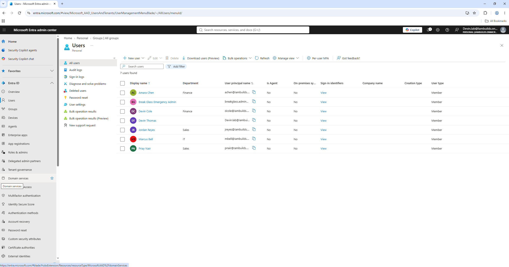
*5 named test users, break glass account, and admin account in the tenant*

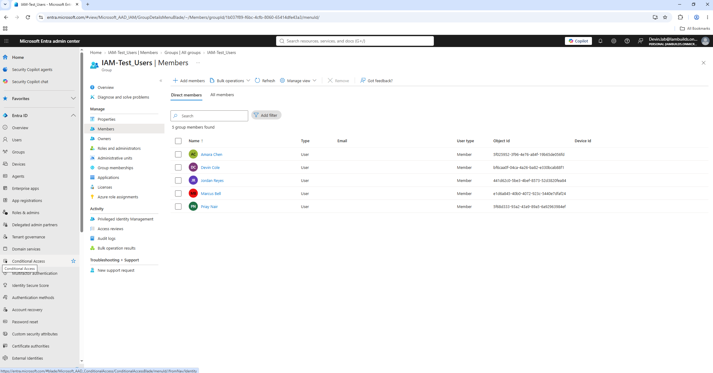
*IAM-Test-Users group with correct member population*

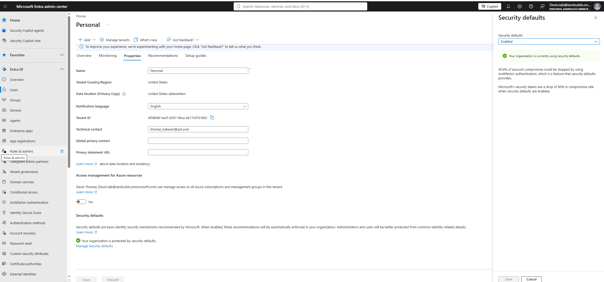
*Security defaults enabled, before state*

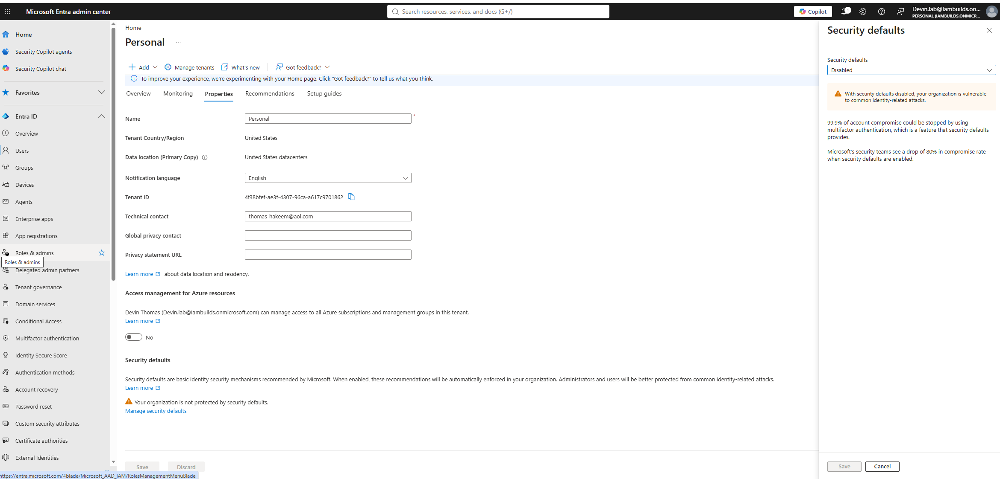
*Security defaults disabled, after state*

**CA01, Require MFA for All Users**

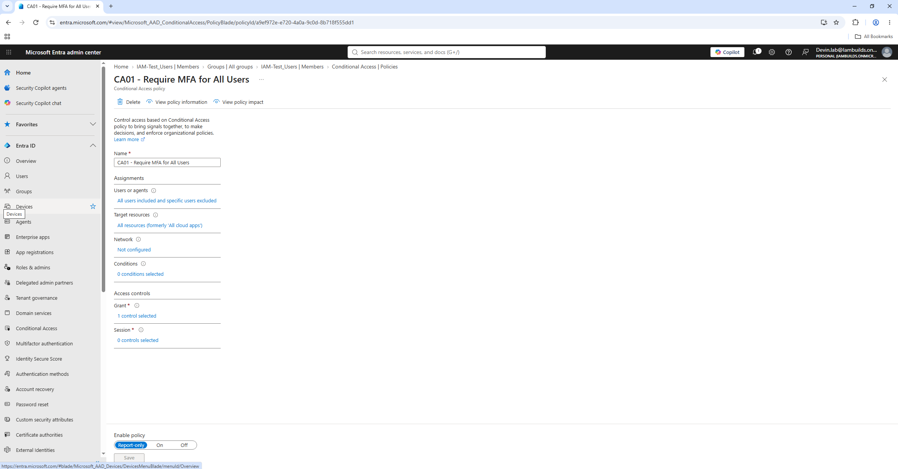
*CA01 built in Report only mode*

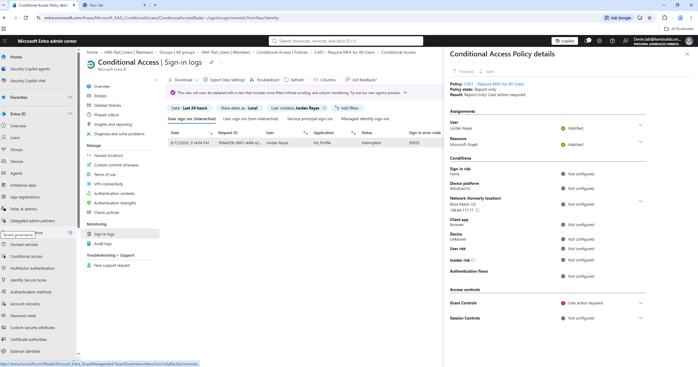
*CA01 Report only result against a real test sign in*

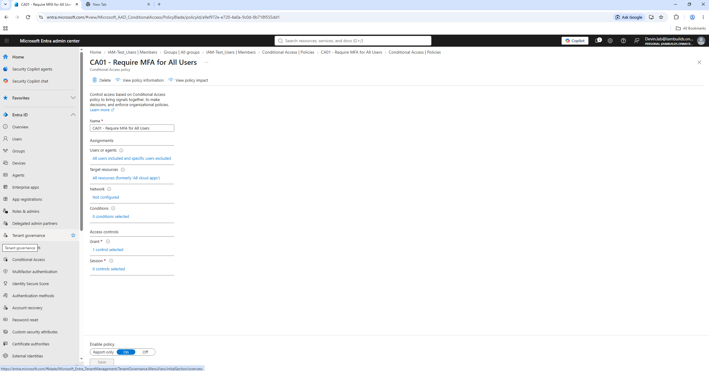
*CA01 switched to On*

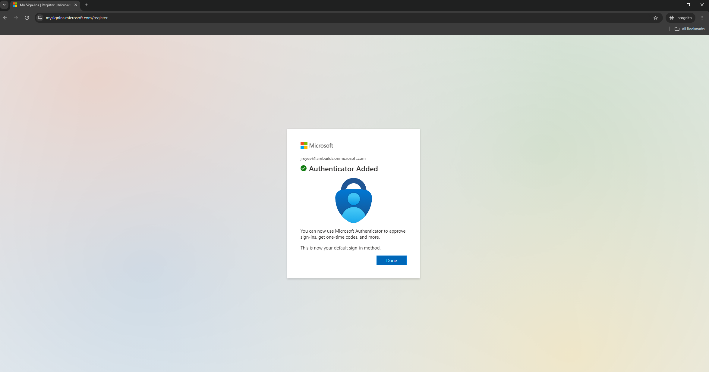
*Live MFA registration triggered by enforcement*

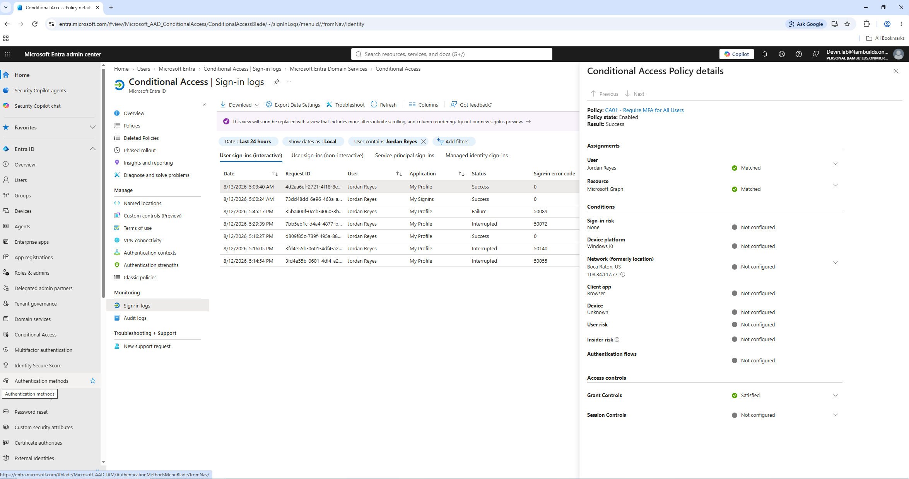
*CA01 enforced with a confirmed Success result*

**CA02, Require Compliant Device**

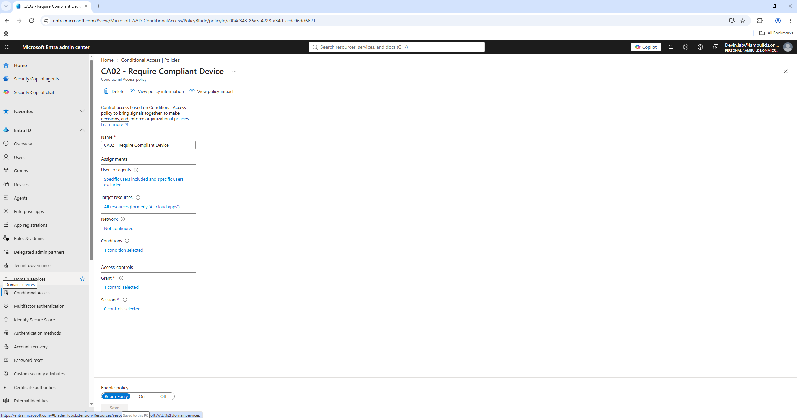
*CA02 built, scoped to the test group*

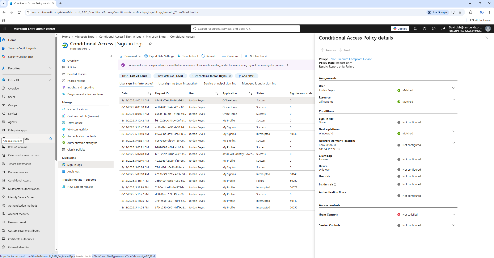
*CA02 Report only result, documented limitation*

**CA03, Block High Risk Sign-ins**

*CA03 built with Medium and High risk conditions and Block access*

**CA04, Block Access Outside Trusted Locations**

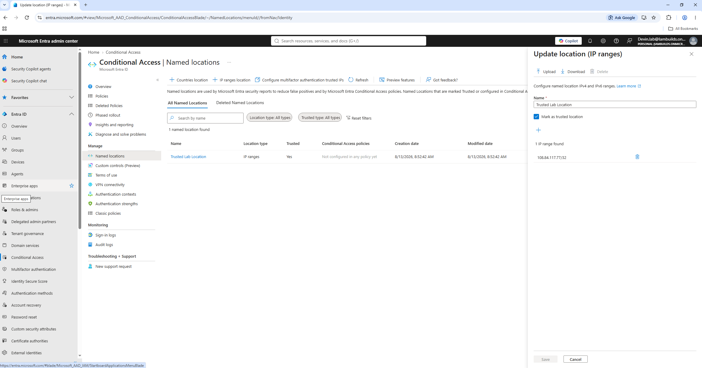
*Trusted lab IP range defined as a Named Location*

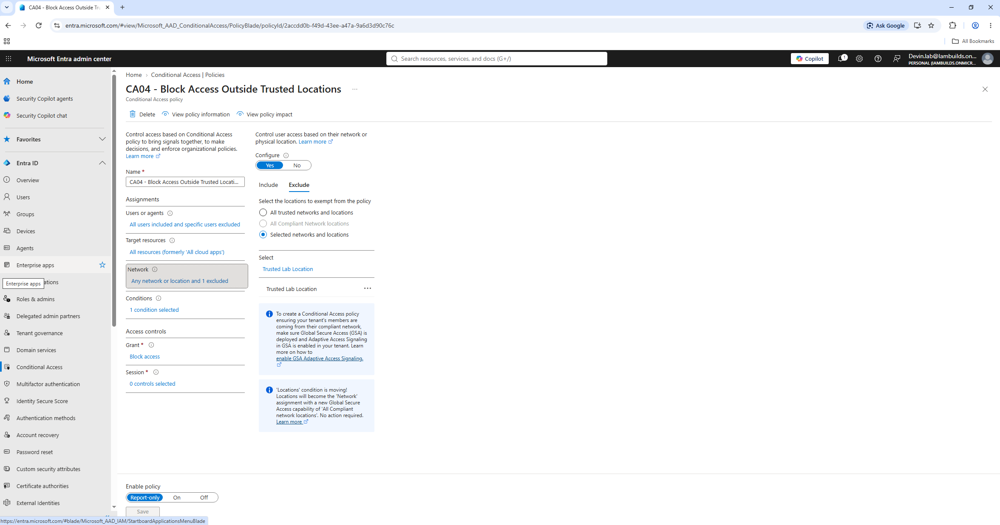
*CA04 built with the trusted location exclusion*

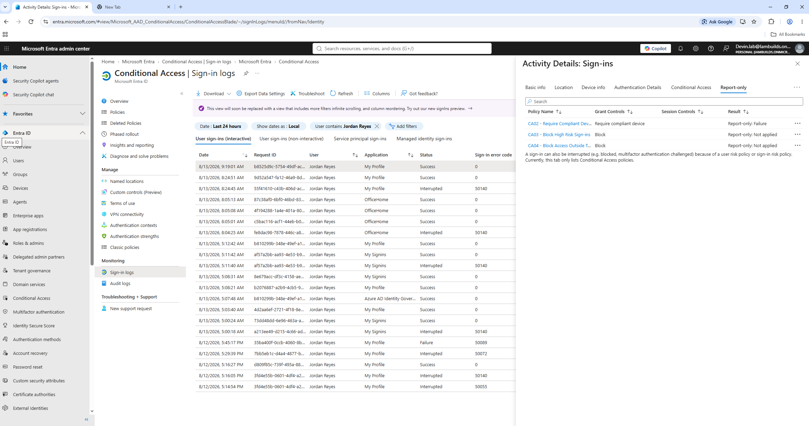
*CA04 and CA03 both confirmed evaluating correctly from a trusted sign in*

**CA05, Break Glass Account Monitoring**

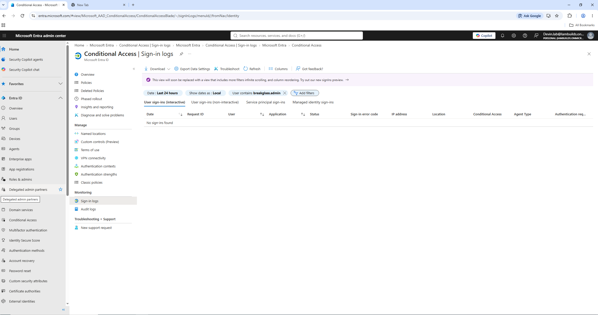
*Break glass account log filter, dormant baseline*

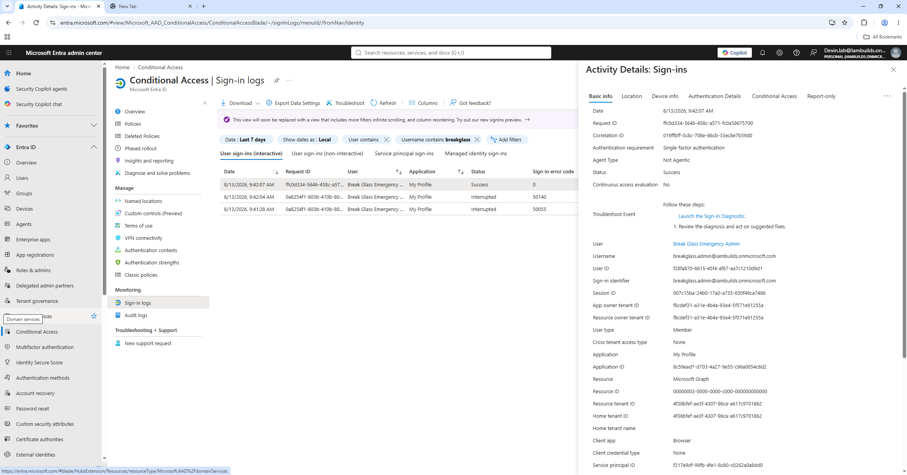
*Break glass sign in detected, proof of concept for CA05*

**Privileged Identity Management**

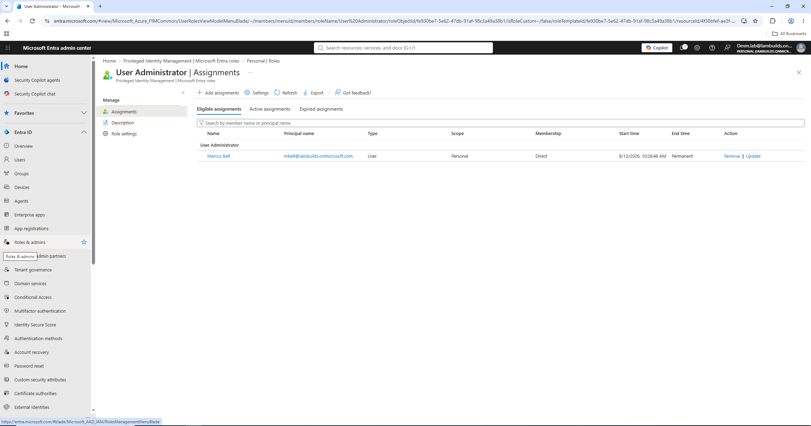
*Marcus Bell configured as Eligible for User Administrator via PIM*

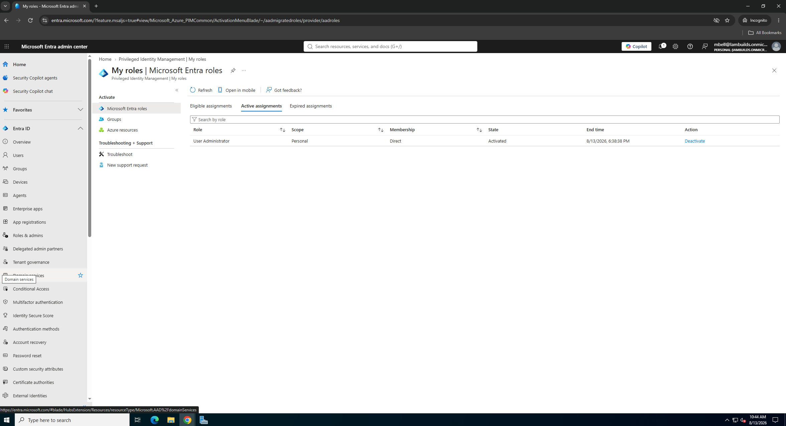
*Live role activation confirmed on the requesting user's Active assignments tab*

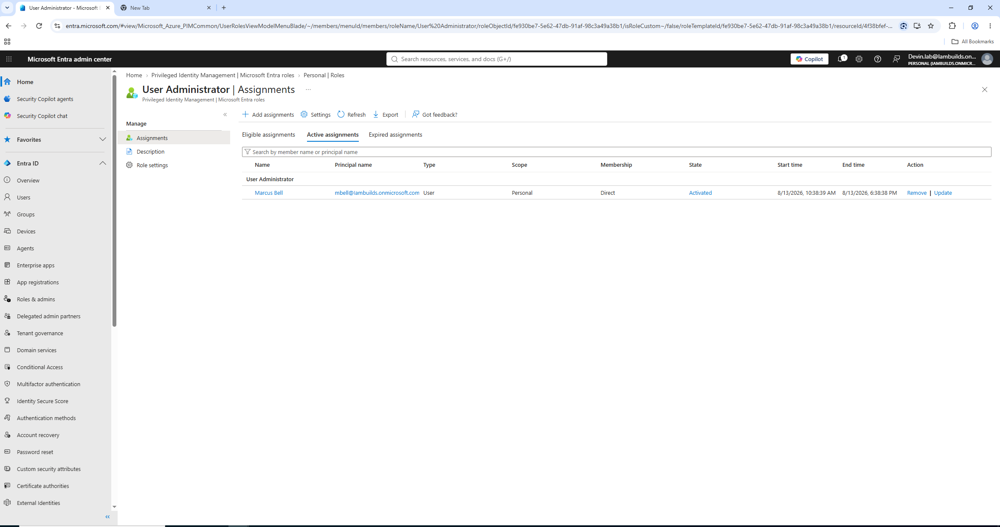
*Admin side confirmation of the active, time bound assignment*

## Key Troubleshooting Moments

- Discovered Security defaults was blocking custom Conditional Access from functioning, identified the conflict and resolved it before building any policy.
- Corrected a group membership mistake where users were added as Owners instead of Members, which would have prevented group scoped policies from applying to them.
- Diagnosed a token reuse issue where certain sign ins showed "Not applicable" in the Conditional Access logs because the session reused an existing claim rather than triggering a fresh evaluation, resolved with a full sign out and new session.
- Recognized that CA01 enforcement would interrupt users with no MFA method registered, walked through registration, and confirmed the full before and after enforcement story in the logs.
- Made and documented a real architecture tradeoff for CA05, choosing a lightweight scripted detection method over Log Analytics for a lab environment without a linked Azure subscription.

## Resume Bullet

Architected 5 policy Conditional Access framework enforcing Zero Trust principles, implemented break glass monitoring and PIM just in time access for privileged roles.

This bullet was verified against the actual work in this repo rather than copied from a template, every claim in it maps to a tested, screenshotted result above.

## Next Steps

CA05's break glass detection will be converted into a scheduled PowerShell script with email alerting in Week 8, completing the monitoring lifecycle from manual verification to full automation.
